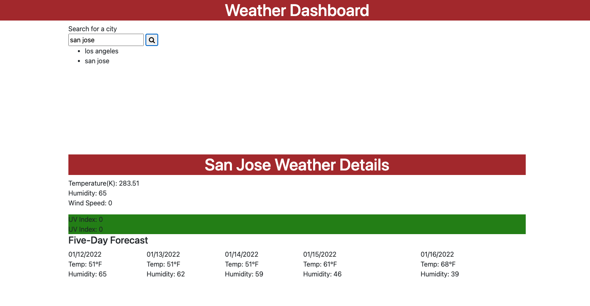

# Weather-Dashboard

The purpose of this Weather Dashboard is to provide travelers a weather outlook of the cities that they have selected. This application is built with HTML, CSS, JavaScript, and also powered by jQuery and Bootstrap. Travelers are able to do a global city search. This application utilizes a third-party API, OpenWeatherMap, to retrieve weather data for cities. LocalStorage feature is also incorporated in this application so that users are able to see their search history on the browser. 

## Getting Started

When it runs on a browser, a search box will be displayed asking the user to make a city search. Once it is entered, the city name, the temperature, the humidity, the wind speed, and the UV index of the current date will be displayed in addition to the five-day weather forecast for that city. The search history will be stored in a localStorage so that users can easily access their previous search. The UV Index is color coded to indicate whether the conditions are favorable, moderate, or severe. 

## Built With

* [HTML](https://developer.mozilla.org/en-US/docs/Web/HTML)
* [CSS](https://developer.mozilla.org/en-US/docs/Web/CSS)
* [Javascript](https://developer.mozilla.org/en-US/docs/Web/JavaScript)
* [w3schools](https://www.w3schools.com/js/default.asp)
* [Moment.js](https://momentjs.com/docs/)
* [jQuery User Interface](https://jqueryui.com)
* [Bootstrap](https://getbootstrap.com)
* [US Enviromnetal Protection Agency](https://www.epa.gov/sunsafety/uv-index-scale-0)

## Deployed Link

* [Deployed Link to Live Site](https://mandytsang007.github.io/Weather-Dashboard/)
* [Link to Github](https://github.com/MANDYTSANG007/Weather-Dashboard)

## Design Layout

## Authors

* **Mandy Tsang** 

- [Portfolio](https://mandytsang007.github.io/HMT-Portfolio/)
- [Github](https://github.com/MANDYTSANG007)
- [LinkedIn](https://www.linkedin.com/in/mandy-tsang-896b2682)

## License

This project is licensed under the MIT License 

